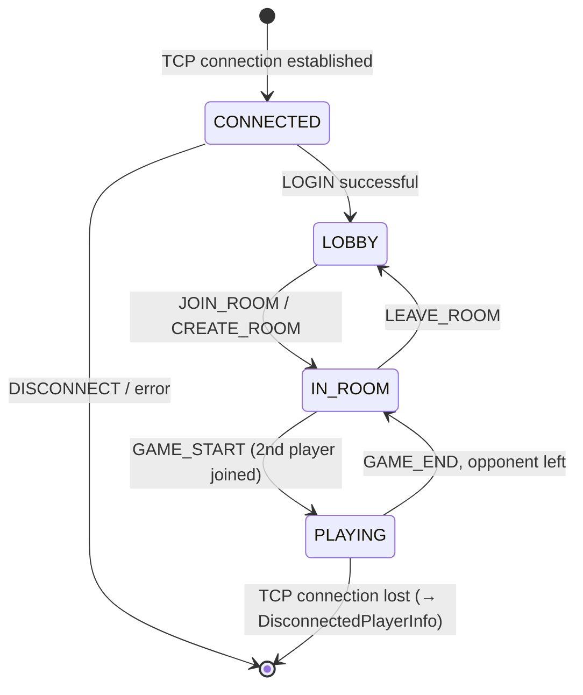
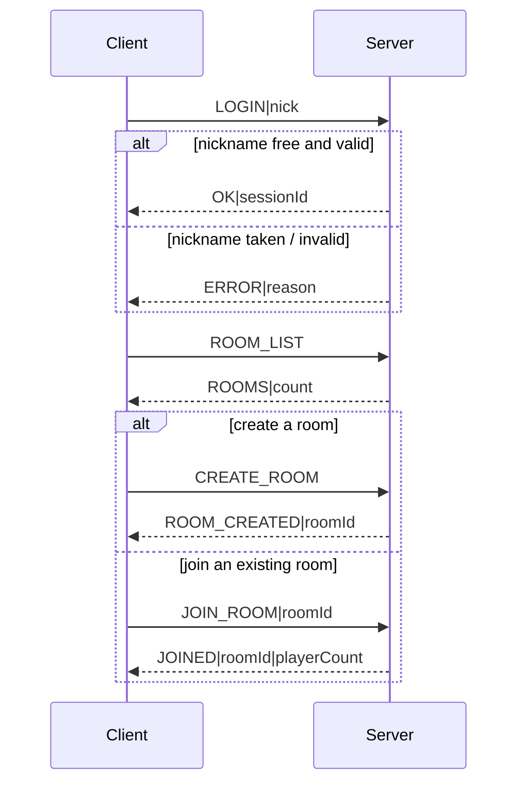
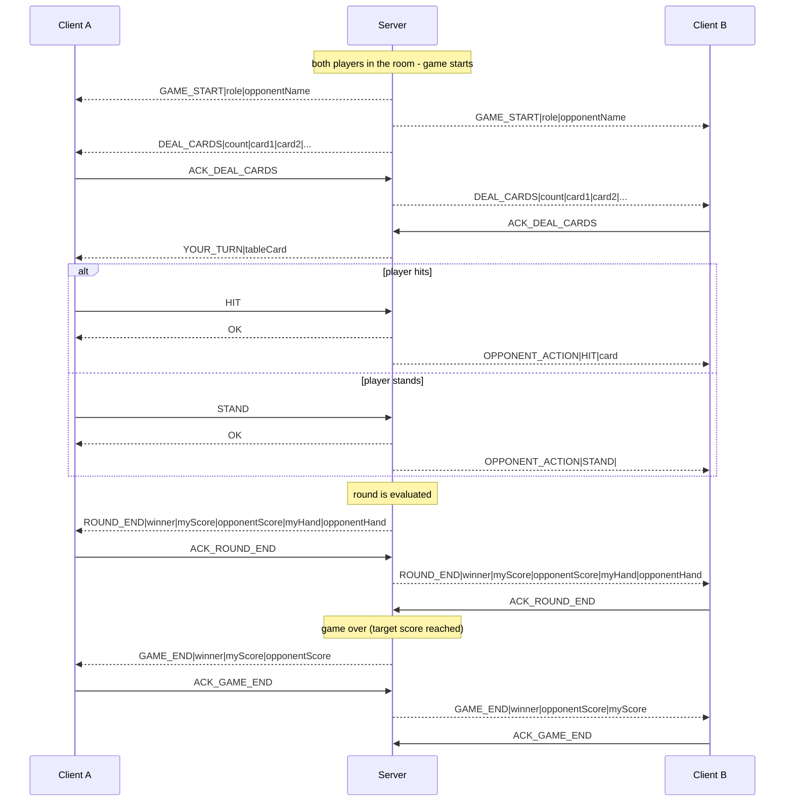
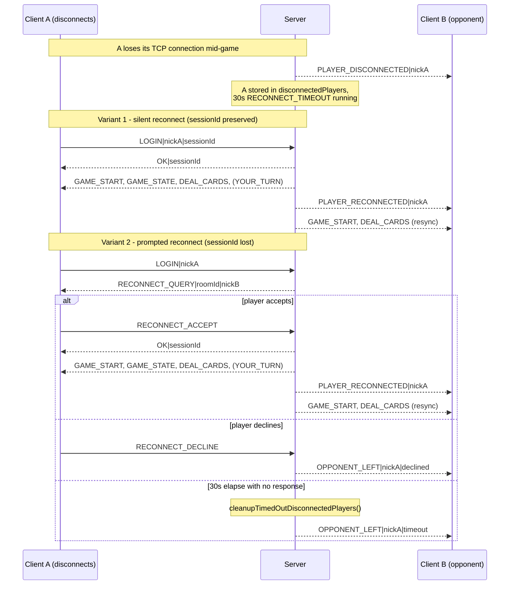

# Network Protocol – Oko bere

A text-based protocol over TCP. Every message has the form:

```
COMMAND|param1|param2|...\n
```

- `|` separates message fields (`Protocol::DELIMITER`)
- `\n` terminates the message (`Protocol::MESSAGE_END`)
- max message length is 4096 B; disallowed characters in payload data (nickname etc.) are escaped
- the client moves through states `CONNECTED → LOBBY → IN_ROOM → PLAYING`

## Client state diagram



## 1. Login and lobby



## 2. Game round

Game start, a single round (BANKER vs. player), and its end. `DEAL_CARDS` and `ROUND_END`/`GAME_END` are acknowledged via ACK messages (an application-level reliability layer on top of TCP).



## 3. Disconnect and reconnect

The most interesting part of the protocol. Two cases are distinguished: a **silent reconnect** (client still has its `sessionId`, e.g. just a brief network drop) and a **prompted reconnect** (client app restarted and lost its `sessionId`, so the server recognizes it only by nickname).


