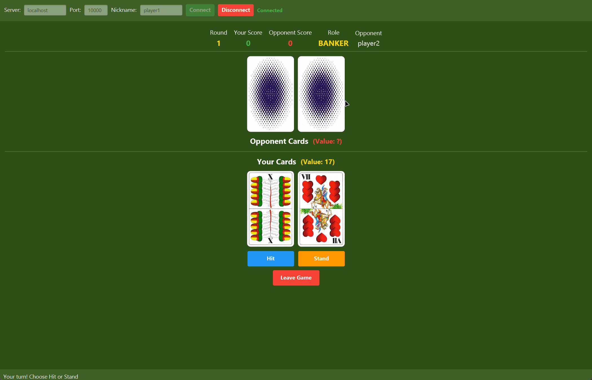
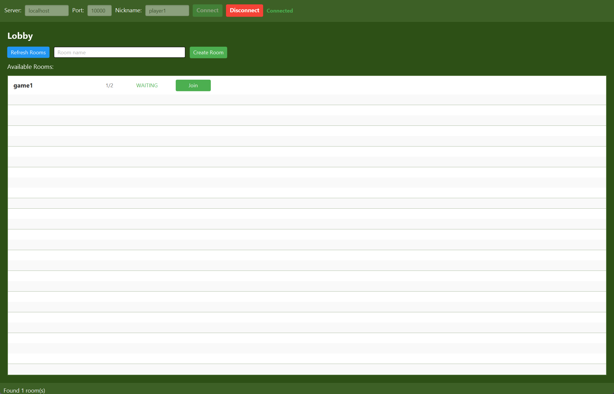
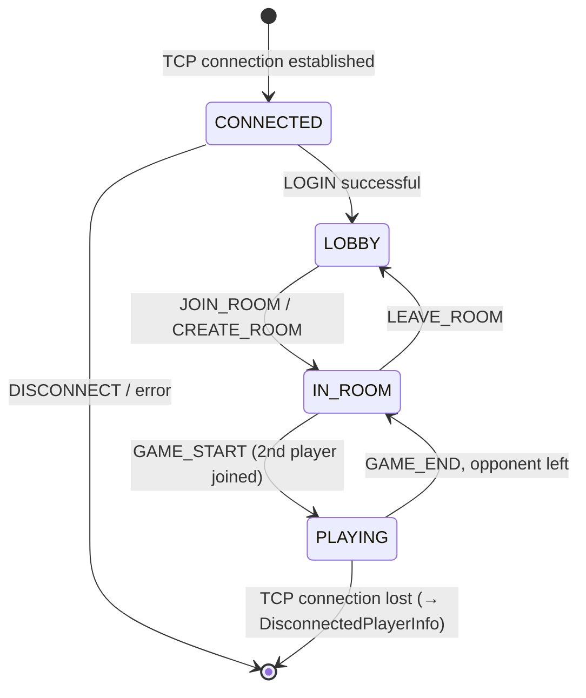
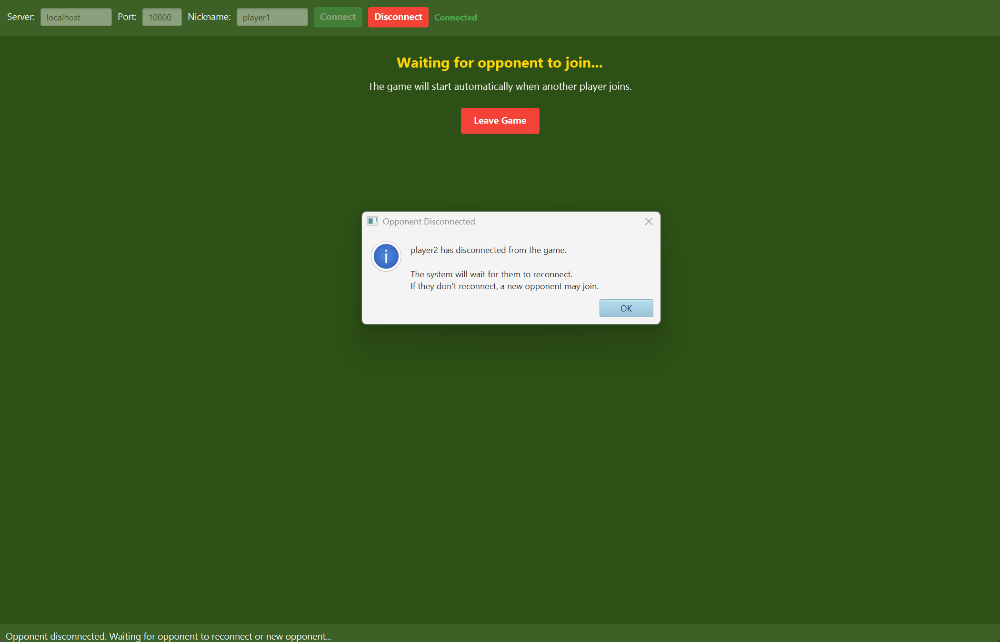
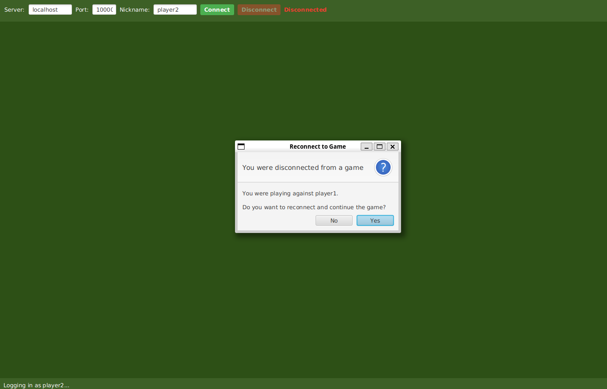

# Oko Bere

A client-server implementation of *Oko bere* (a Czech card game similar to Black Jack), built as a semester project for the **Introduction to Computer Networks** course at the Faculty of Applied Sciences, University of West Bohemia.

The project consists of a multi-threaded C++ TCP server and a JavaFX desktop client communicating over a custom text-based protocol.



## Features

- Custom `|`-delimited, `\n`-terminated text protocol over TCP (see [PROTOCOL.md](PROTOCOL.md) for the full message flow and diagrams)
- Multi-room, multi-client server (thread-per-client, `std::mutex`-guarded shared state)
- Application-level reliability: ACK messages for critical state updates (`DEAL_CARDS`, `ROUND_END`, `GAME_END`, `GAME_STATE`)
- Reconnect handling - a player who drops mid-game can resume the same game, either silently (if the client kept its session ID) or after confirming a prompt (if the client app was restarted), with a 30s timeout before the game is forfeited
- Idle/keep-alive detection via `PING`/`PONG` and disconnection after repeated invalid messages
- JavaFX GUI client with card graphics, lobby/room browser, and reconnect dialogs

## Project structure

```
server/   C++17 TCP server (CMake / Makefile)
client/   JavaFX desktop client (Maven)
```

## Building and running

### Server

Requires a C++17 compiler and `pthread`.

```bash
cd server
make
./oko_bere_server <ip> <port> [-c <max_clients>] [-r <max_rooms>]

# example
./oko_bere_server 127.0.0.1 10000 -c 10 -r 5
```

Stop the server with `Ctrl+C` for a graceful shutdown (disconnects clients, frees resources).

Alternatively, build with CMake:

```bash
cd server
mkdir build && cd build
cmake ..
make
./oko_bere_server <ip> <port> [-c <max_clients>] [-r <max_rooms>]
```

### Client

Requires JDK 21+ and Maven (or use the bundled `./mvnw`).

```bash
cd client
./mvnw clean javafx:run
```

On startup, enter the server address, port and a nickname to connect. From the lobby you can create or join a room; once a second player joins, the game starts automatically.



## Protocol

See [PROTOCOL.md](PROTOCOL.md) for the full message format and sequence diagrams covering login/lobby, a full game round, and the disconnect/reconnect flow. Client state machine:



If a player drops mid-game, the opponent is notified and the game waits for them to come back:



If the returning client lost its session (e.g. the app was restarted), it prompts the player to resume the game instead of reconnecting silently:



## Documentation

[docs/UPS_Doc.pdf](docs/UPS_Doc.pdf) - the full project documentation submitted for the course (in Czech): game rules, protocol specification, implementation details (module breakdown, concurrency model, reconnect mechanism), build/run instructions, and testing notes.

## Credits

Card images in `client/src/main/resources/cz/zcu/kiv/ups/sp/assets/` are from [tomasdrus/hungarian-playing-cards](https://github.com/tomasdrus/hungarian-playing-cards) and are not covered by this project's license.

## License

MIT, except for the card images - see [LICENSE](LICENSE) and [Credits](#credits).
